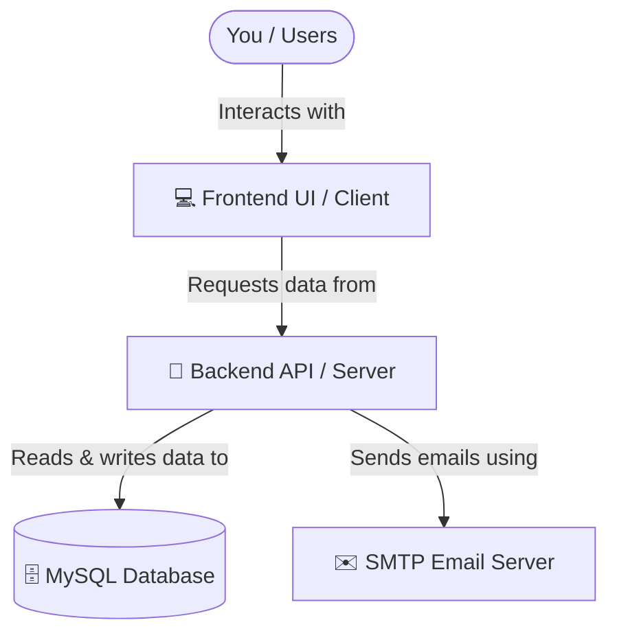

# 🚀 Getting Started Guide: Run Your Application

Welcome to your new custom application! This guide is written specifically for you (the project owner) to help you set up and run the application on your computer. You don't need any prior coding or software development experience to follow this guide.

---

## 🗺️ How the System Works (In Simple Terms)

Your application is split into three main parts:



1. **💻 Frontend (The Visual App):** This is the website interface you see in your browser. It handles what you click on, the pages you see, and how the app looks. (Built with Angular).
2. **🧠 Backend (The Brains):** This runs behind the scenes. It handles user logins, checks credentials, calculates numbers, generates PDFs, and processes all your instructions. (Built with Node.js & Express).
3. **🗄️ Database (The Memory):** This is where all your accounts, records, and information are saved. It stays saved even when you turn off the application. (Built with MySQL).

---

## 🛠️ Step 1: Install the Required Tools

To run the application, you need to install two free programs on your computer.

### 1. Node.js (The Engine)
Node.js allows your computer to run the Javascript code that makes up the Frontend and Backend.

*   **How to install:**
    1. Go to the official website: **[https://nodejs.org/](https://nodejs.org/)**
    2. Click on the button labeled **LTS** (Long Term Support) to download the installer for Windows.
    3. Open the downloaded file and click **Next** through the installer using the default settings.
*   **How to verify:**
    *   Open your search bar in Windows, type `cmd` (Command Prompt), and open it.
    *   Type `node -v` and press Enter. You should see a version number (like `v20.x.x` or `v22.x.x`).

### 2. MySQL & MySQL Workbench (The Database)
This stores your data. We recommend using the **MySQL Installer** which packages the database server and a visual interface to look at your data (Workbench).

*   **How to install:**
    1. Go to: **[https://dev.mysql.com/downloads/installer/](https://dev.mysql.com/downloads/installer/)**
    2. Download the web community installer (click the first "Download" button).
    3. Open the installer. If it asks you to choose a setup type, select **Developer Default** or **Full**.
    4. During setup, you will be asked to set a **Root Password** for your database.
        > [!IMPORTANT]
        > **Remember this password!** You will need to write it down in the application configuration in the next step.
    5. Keep clicking **Next** until installation is complete.

---

## ⚙️ Step 2: Configure the Database

Before starting the backend, you need to tell it how to connect to your MySQL database.

1. Open the project folder on your computer.
2. Navigate to the **`backend`** folder.
3. Find and open the file named **`config.json`** using any text editor (like Notepad, VS Code, or Notepad++).
4. You will see something like this:
   ```json
   {
     "database": {
       "host": "localhost",
       "port": 3306,
       "user": "root",
       "password": "",
       "database": "admin_app"
     },
     "secret": "superultramegahardtoguesssecret",
     "emailFrom": "info@my-node-api.com",
     "smtpOptions": { ... }
   }
   ```
5. Modify the **`password`** field:
   *   Replace `""` with the database password you created during the MySQL installation.
   *   *Example:* If your database password is `MyDatabasePassword123`, change it to:
       ```json
       "password": "MyDatabasePassword123",
       ```
6. **Save and close the file.**

> [!TIP]
> **No database creation required!** The application is smart; it will automatically create the database tables and schema inside MySQL for you the first time you run it.

---

## 🏃‍♂️ Step 3: Run the Application (Step-by-Step)

Because the application has two separate parts (Frontend and Backend), you need to open **two separate Command Prompt windows** to run them at the same time.

### Part A: Start the Backend (The Brain)
1. Open a new **Command Prompt** (search `cmd` in Windows).
2. Go into the project directory. If the project is located in your Documents folder, type:
   ```bash
   cd Documents/Intpro-project/backend
   ```
   *(Adjust this command if your project folder is saved in a different location).*
3. Install the required libraries (you only need to do this the **very first time** you setup the project):
   ```bash
   npm install
   ```
4. Start the backend:
   ```bash
   npm run dev
   ```
5. You should see a message saying: `Server listening on port 4000`. Keep this window open!

### Part B: Start the Frontend (The Visuals)
1. Open a **second, separate Command Prompt window** (do not close the first one!).
2. Go into the frontend folder:
   ```bash
   cd Documents/Intpro-project/frontend
   ```
3. Install the required libraries (only needed the **very first time**):
   ```bash
   npm install
   ```
4. Start the frontend:
   ```bash
   npm start
   ```
5. The application will compile. Once finished, it will automatically open your web browser to:
   👉 **`http://localhost:4200`**

---

## 🔍 Step 4: Verify Everything is Working

*   **Frontend Check:** Open **`http://localhost:4200`** in your browser. You should see your user interface (login/registration screen).
*   **Backend Check:** Open **`http://localhost:4000/api-docs`** in your browser. This will open a visual API documentation page showing all database connections are working.
*   **PDF Documentation Check:** Open **`http://localhost:4000/documentation-pdf`** to automatically download a system documentation PDF.

---

## 🛠️ Troubleshooting & Common Issues

### ❌ Error: "npm is not recognized..."
*   **What it means:** The command prompt doesn't know what `npm` is.
*   **How to fix:** This happens if you opened the command prompt *before* finishing the Node.js installation. Close all command prompts, reopen them, and try again.

### ❌ Error: "Access denied for user 'root'@'localhost'"
*   **What it means:** The password in `backend/config.json` doesn't match your MySQL root password.
*   **How to fix:** Re-read **Step 2** and verify you typed the correct MySQL root password.

### ❌ Error: "Port 4000 (or 4200) is already in use"
*   **What it means:** The application is already running in another terminal, or another program is blocking that port.
*   **How to fix:** Close any existing Command Prompt windows and run the command again. If it persists, restart your computer.

### ✉️ Where do registration emails go?
By default, the application uses a test email service (**Ethereal Email**). Emails sent by the app (like password resets or verifications) will not go to real email addresses. If you want to use a real email service (like Gmail or Outlook), update the `smtpOptions` in `backend/config.json` with your SMTP server details.
